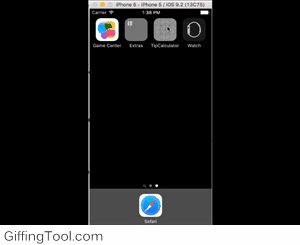

# TipCalculator
Beginners ios app calculates tip 

**Submitted by**: Jaber Janati

**Time Spent**: 20 hours

##User Stories
User can enter a bill amount, choose a tip percentage, and see tht tip and total values

##Optional:
Added settings pafe to change the default tip percentage
Remembers the bill amount across app restart

##Video walkthough:

Gif created with the giffing tool
#Notes
Challenges of the app was getting the settings page to work with the main story and having
the values updated after a change

